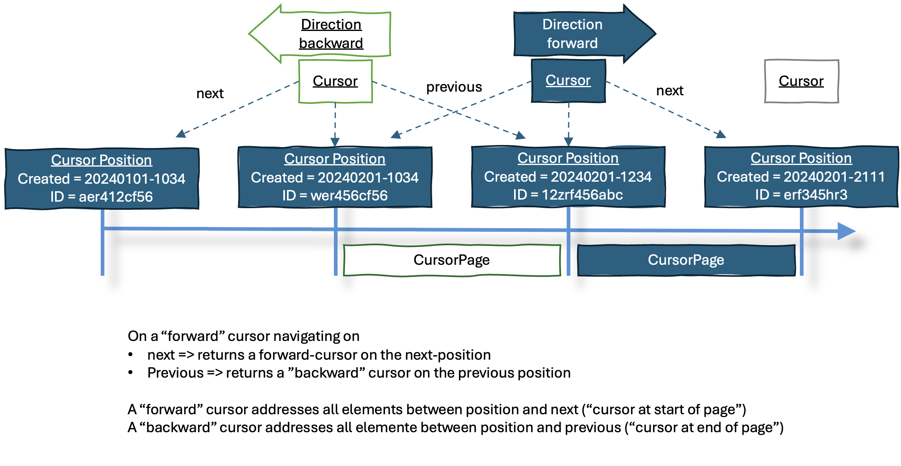

# Spring Cursor based Paging
Library supporting cursor based paging for Spring Data Repositories.

# Introduction
Cursor based paging is an alternative to the Page/Pagerequest based paging provided by Spring.
It eliminates the need to provide an offset or a page-number which can cause a lot of load on a database in case of very large amount of records in a table.

# Requirements
- The implementation should follow the repository concept from spring.
- Ordering by arbitrary columns should be possible.
- A filtering mechanism should be provided
- Total count of records is not part of the page response and not executed while retrieving the page
- No SQL limit/offset and no DB-cursor should be used
- State is send to the client and returned to the server for the next page

# Basic idea
A Cursor is nothing elsa than a position in a list of records.
The content of the page is just the next n-records after the cursor.
It is important, that the records do have a well defined order, to make this return predictable results.

Databases are very fast, when querying indexed columns or fields. 
Most DBs do have something like an ID/Primary Key (PK) to uniquely identify a record, still a cursor must not be restricted to only use PKs.

Assuming we use a numeric PK a query for the first page could look like this:
```sql
SELECT * FROM table WHERE id > 0 ORDER BY id ASC LIMIT 10
```  
The next cursor is the last id of the result set. Page 2 would look like this:
```sql
SELECT * FROM table WHERE id > 10 ORDER BY id ASC LIMIT 10
```
and so on. 

In real life this is a little more complicated as the desired order of the records depends on the use case (could e.g. creation time or a status-field), and there is no gurantee that this order doesn't change from query to query.

# Implementation


# Making things more complicate
Potentially, a curosr can be reversed, meaning  the query direction can be changed. This would add the feature to the cursor page to not only point to the next page but also to the previous result-set. Still - this must not be misunderstood as the privous page! This is not easily possible, because for doing this it would be needed to have all previous pages still in memory or somehow stored with the cursor.
Such an reversed cursor is, when used, changing the direction of the query.



There is only value in this feature, if the client is not able to cache the previous requested pages by himself, i.e. forgets them while moving forward. This might be the case in a very memory limited client scenario which is usually _not_ a web application/web browser.

# Limitations
- Such a cursor implementation is not transaction-safe. Which is good enough for most UIs and it is not so important, to miss a record or have a duplicate one in two page requests. This is i.e. the case when the PK is not an ascending numerical ID but maybe an UUID, so that it is possible that an inserted record apears before the page which a client is going to request. In case you need transaction-safe cursor queries, this is most likely a server-side use case and you can use DB-cursors.
